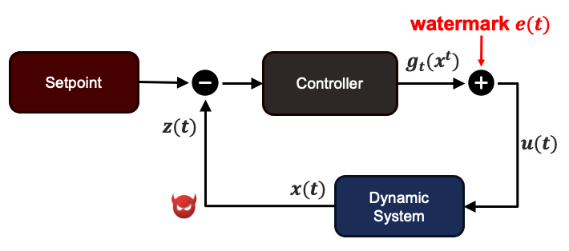
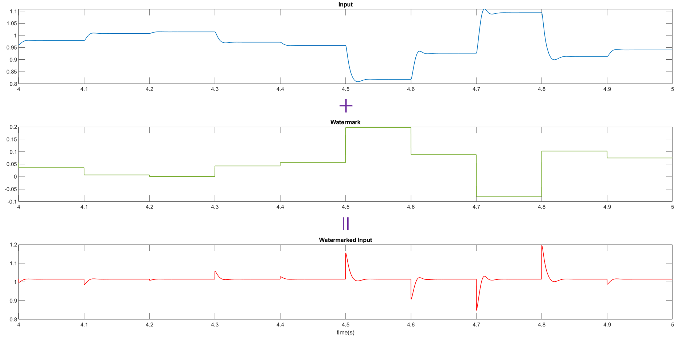
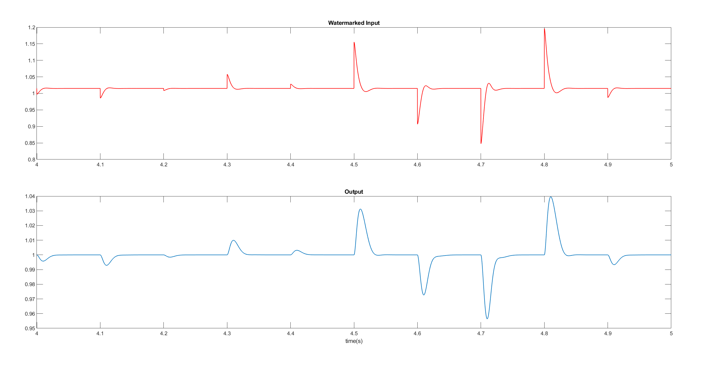
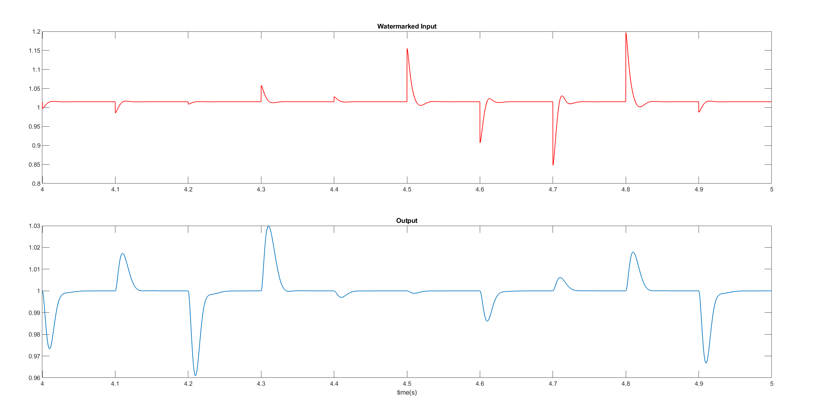
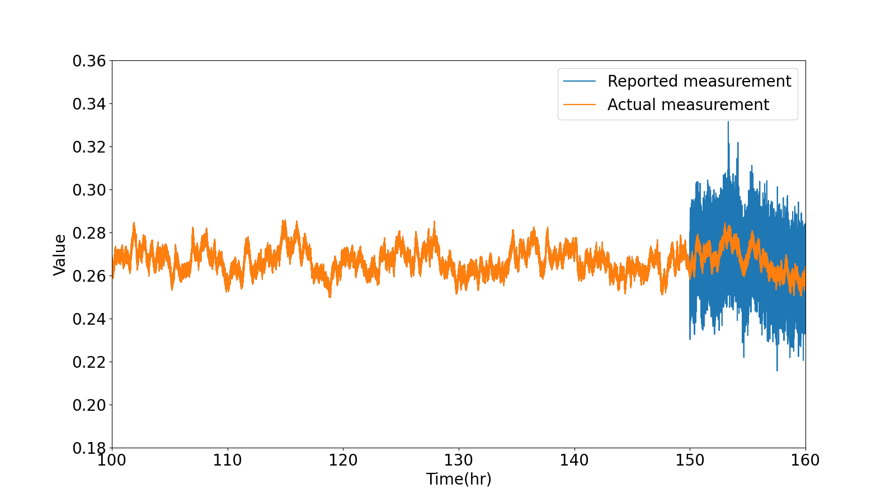

Networked control system are vulernable to cyber attack

The idea of dynamic watermarking is very simple. If we add a small signal at input, the output will be affected. By checking whether the chagne of the output is corrsponding to the small signal we added, we can tell whether the signal is authentic. Let's see a simple example. The watermark will be added to the control input signal and the signal will become watermarked input. 

The figure below is a pair of watermarked input and system output. As we can see, the output change does follows the change of the watermarked input.

However, the output in the figure below is not the correct output. It is highly likely that the output measurment has been modified or there is something wrong with the system.

Tennessee Eastman Process is a model of an industrial chemical process for developing, studying and evaluating process control technology. The model involves five major unit operations. The relationship between each unit is in the figure at the top. There are 12 control inputs and 41 measurments. 

There

**ARMAX MODEL**

$$
 \begin{align*}
    y(k+1) &= \sum_{i=0}^{p}\alpha_iy(k-i)+ \sum_{i=0}^{q}\beta_iu(k-i-d+1)\\\\\\
    &\underbrace{+ \sum_{i=0}^r \gamma_i w(k-i)+ w(k+1).}_{\text{ colored noise}}
\end{align*}
$$

**Result**

The following an example of noise injection attack. At time 150hr, a random noise will be added to the output measurement. This attack might not cause instability to the system, but it will reduce the efficiency of the system.

The following are the value of the watermark tests. As we can see the value exceed the threshold after the attack, which will be classified as detected.

