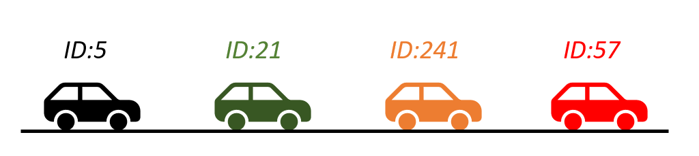

*I work on the experiment part of this work.*

The goal of the project is to identify a specific car in a platoon of autonomous vehicles. Let's consider an example to understand why this is necessary.

In the figure above, there are four autonomous vehicles in the platoon, each with a unique ID. However, for the controller, only the presence of four cars in the platoon is known, but not their order. For instance, suppose car 21 is going to turn left at the next intersection. The platoon should split into two groups, requiring cars 5 and 21 to slow down. However, without knowledge of the relative location of each car in the platoon, it is challenging to execute this maneuver.

The method to identify a car in a platoon is as follows: a small signal is added to the control input, and a roadside sensor, such as a camera or radar, captures the movement of the car. For example, if the command is sent to car 21 to move slightly left, then the car that moves left in the platoon will be identified as car 21. This allows for the determination of the relative location of each car in the platoon.

The experiment for this project involves using an autonomous vehicle and a roadside radar to validate this method. The autonomous vehicle used is a Lincoln MKZ modified by Dataspeed, as shown in the image above. The vehicle is equipped with a pair of lidars, a camera, a radar, high-precision GPS, and an IMU. Communication and message passing are primarily achieved through the Robot Operating System (ROS). To become familiar with the system, simulations were conducted before field experiments. The simulator provided by Dataspeed mirrors the structure of the real MKZ system, with control commands sent to Gazebo and visualized in rviz. The simulator includes configurations for the car and sensors. Our controller was implemented based on this simulator.

The radar used in the experiment is shown below. It is a traffic radar from Smartmicro capable of providing information on position, speed, and heading of vehicles.

This project is currently being written up for publication. More details will be shared after the paper is published.