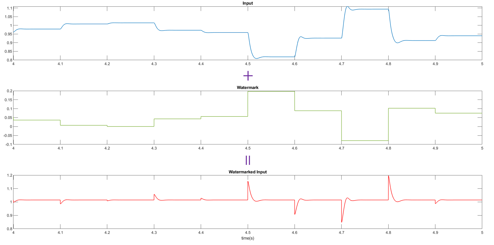
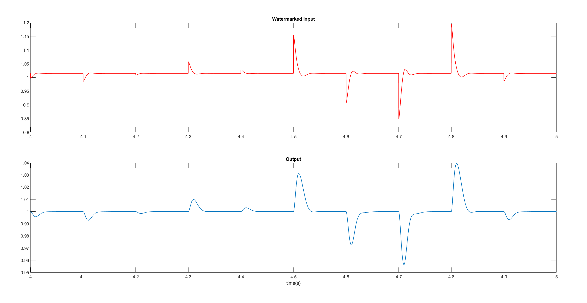
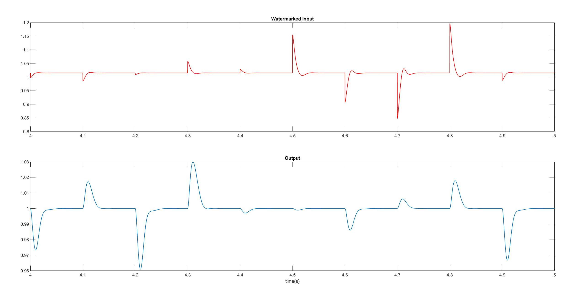
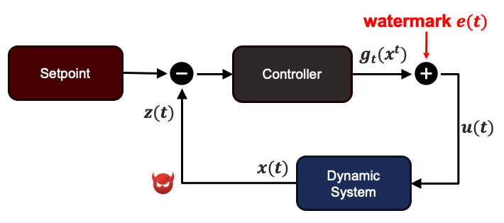
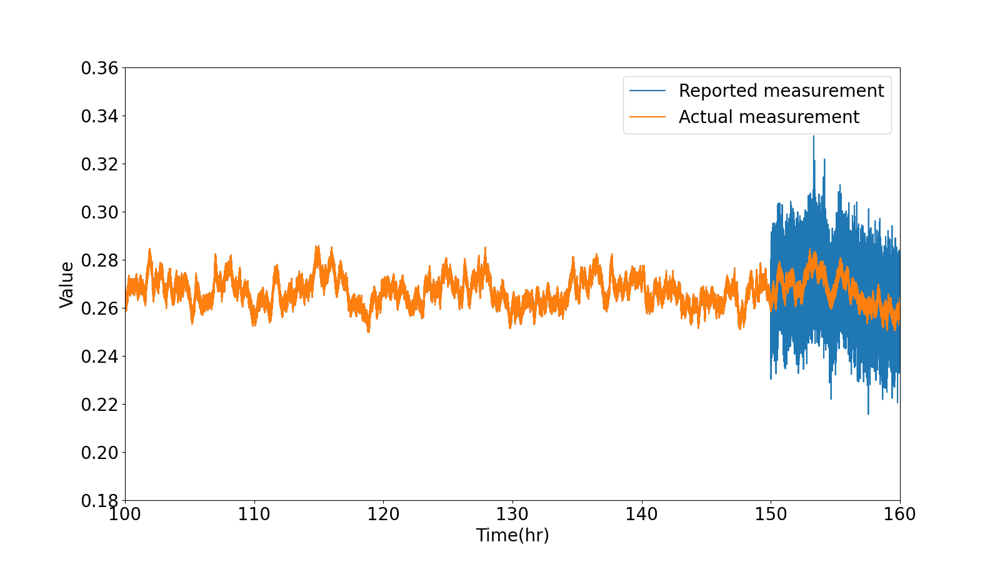
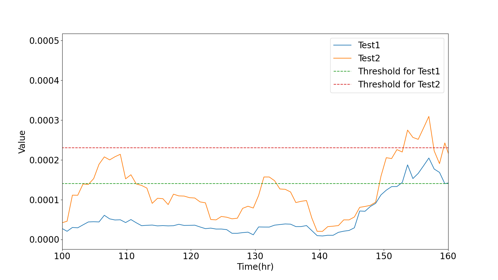

<!-- {}
Click the *Cite* button above to demo the feature to enable visitors to import publication metadata into their reference management software.
{}

{}
Create your slides in Markdown - click the *Slides* button to check out the example.
{}

Add the publication's **full text** or **supplementary notes** here. You can use rich formatting such as including [code, math, and images](https://docs.hugoblox.com/content/writing-markdown-latex/). -->

**Introduction**

Networked cyber-physical systems form the core of critical infrastructures, such as process industries, energy systems, and transportation systems. However, as several recent incidents have shown, sensors or networks carrying sensor measurements can be compromised, leading to system misbehavior. Since infrastructure systems are crucial for safety and the economy, detecting such attacks is essential. One method for this is Dynamic Watermarking.

**Tennessee Eastman Process**

The Tennessee Eastman Process is a model of an industrial chemical process used for developing, studying, and evaluating process control technology. The model comprises five major unit operations, with the relationships between each unit shown in the figure above. The system involves 12 control inputs and 41 measurements.

 **Dynamic Watermarking**

The concept of dynamic watermarking is straightforward. By adding a small signal at the input, the output will be affected. Since the watermark is known to us but not to the attacker, we can determine whether the signal is authentic by checking whether the change in the output corresponds to the watermarked input. Consider the following example:

The figure above illustrates a combination of the input signal and the watermark signal. The subsequent figure represents a pair of watermarked input and system output. As shown, the output change follows the change in the watermarked input, indicating authenticity.

 However, if the output, as depicted in the next figure, does not align with expectations, it is highly likely that the output measurement has been modified or there is a fault in the system.

The watermark added to the system is a white Gaussian sequence. This random signal prevents the attacker from predicting the next watermark. Additionally, since it is a random signal, the attacker cannot distinguish the watermark from the noise in the system.

Now, let's delve into the details. A closed-loop dynamical system can be described as follows:

The system can be represented by the equations:

$$
 \begin{align*}
      x(t+1)=a&x(t)+bu(t)+w(t+1), w(t)\sim N(0,\sigma_w^2)i.i.d\\\\\\
      u(t)&=g_t(x^t)+\textcolor{red}{e(t)}, e(t)\sim N(0,\sigma_e^2)i.i.d
 \end{align*}
$$

Here, $z(t)$ is the received value. If the system is honest, $x(t) \equiv z(t)$. The two tests used to detect cyberattacks are:

$$
\begin{align*}
    \lim_{T\rightarrow\infty}\frac{1}{T} \sum_{k=0}^{T-1}&(z(k+1)-az(k)-bg_k(z^k)-be(k))^2=\sigma_w^2\\\\\\
    \lim_{T\rightarrow\infty}\frac{1}{T} \sum_{k=0}^{T-1}&(z(k+1)-az(k)-bg_k(z^k))^2=b^2\sigma_e^2+\sigma_w^2
\end{align*}
$$

If the value of either test exceeds the predefined threshold, the sensor is deemed dishonest.

**ARMAX MODEL**

To perform the watermark tests, the model of the system is required. Here, the ARMAX model is utilized and can be represented as:
$$
 \begin{align*}
    x(k+1) &= \sum_{i=0}^{p}\alpha_ix(k-i)+ \sum_{i=0}^{q}\beta_iu(k-i)\\\\\\
    &\underbrace{+ \sum_{i=0}^r \gamma_i w(k-i)+ w(k+1).}_{\text{ colored noise}}
\end{align*}
$$

This model implies that the output at the next time step is a linear combination of past and current outputs, inputs, and noise. The noise, termed colored noise, is dependent on the past. Given the complexity of the Tennessee Eastman process, the ARMAX model is better suited to describe the system compared to the ARX model. The Extended Least Square method is employed to fit the model and obtain the coefficients $\alpha$, $\beta$, and $\gamma$.

**Result**

Consider the following example of a noise injection attack. At time 150 hr, random noise is added to the output measurement. While this attack may not cause system instability, it does reduce system efficiency. The reported measurment in the figure below is the $z(t)$ and the actual measurment is $x(t)$. Before 150hr $z(t)\equiv x(t)$, and after the attack started, these two values are different.

The following values represent the results of the watermark tests. As shown, the values exceed the threshold after the attack, indicating detection.

**Summary**

The Dynamic Watermarking Tests for ARMAX systems proposed appear to be capable of detecting several cyber attacks on the Tennessee Eastman Process. Here, I've provided simplified concepts from the paper. For more details, please refer to the paper linked at the top of the page.

title: 
summary: <ins>Tzu-Hsiang Lin</ins>, P. R. Kumar
tags:
  - Cybersecurity
date: ''

# Optional external URL for project (replaces project detail page).
external_link: ''

#image:
#  caption: Photo by rawpixel on Unsplash
#  focal_point: Smart

links:
  - icon: pdf
    icon_pack: fab
    name: Paper
    url: https://ieeexplore.ieee.org/abstract/document/10441912
url_code: ''
url_pdf: ''
url_slides: ''
url_video: ''

# Slides (optional).
#   Associate this project with Markdown slides.
#   Simply enter your slide deck's filename without extension.
#   E.g. `slides = "example-slides"` references `content/slides/example-slides.md`.
#   Otherwise, set `slides = ""`.
#slides: example
---

